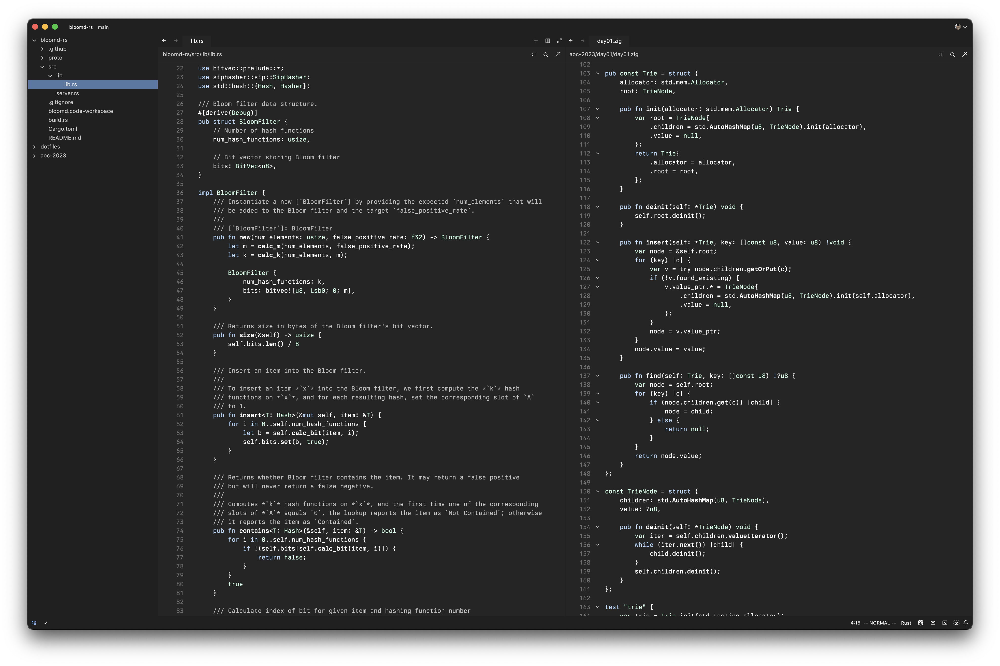
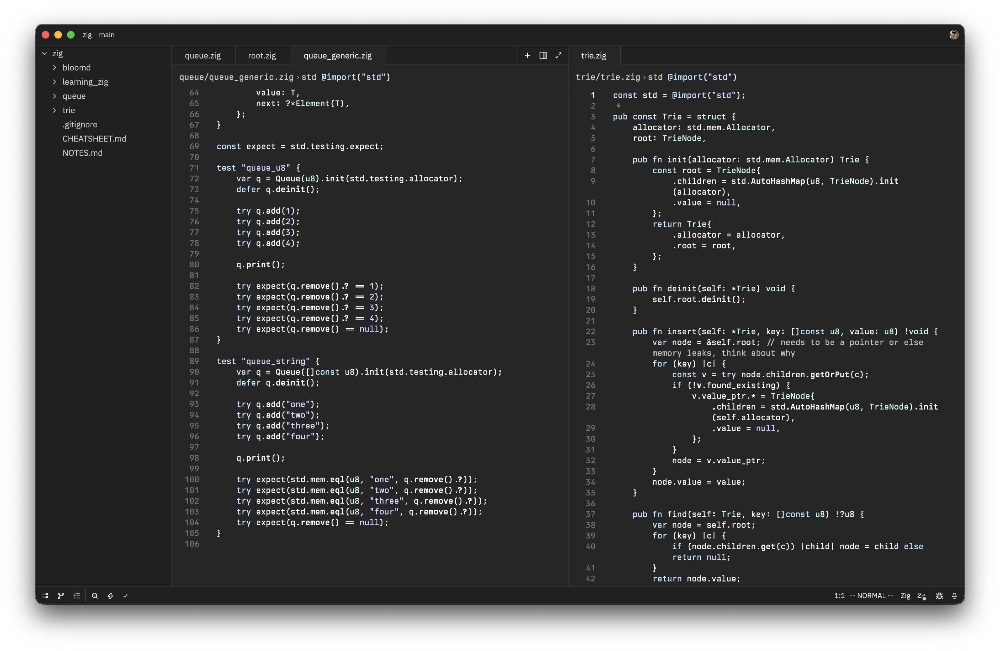
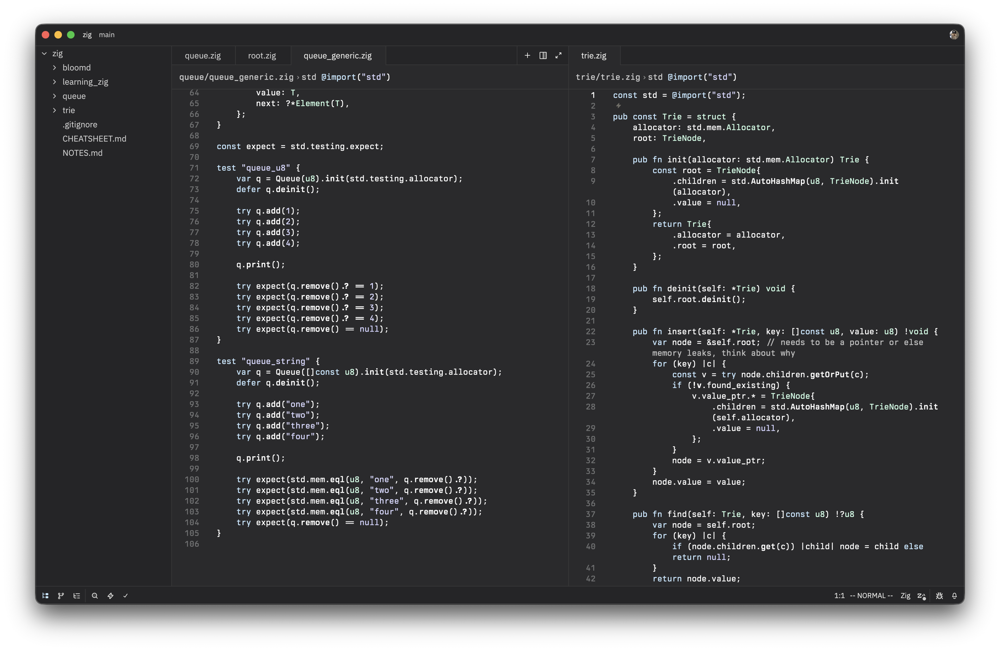
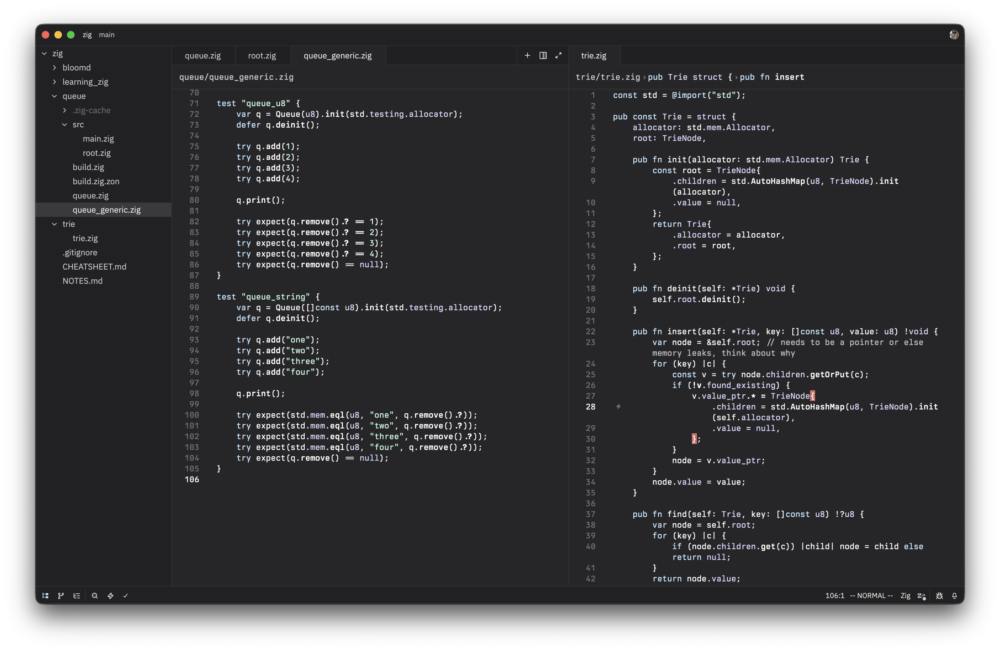
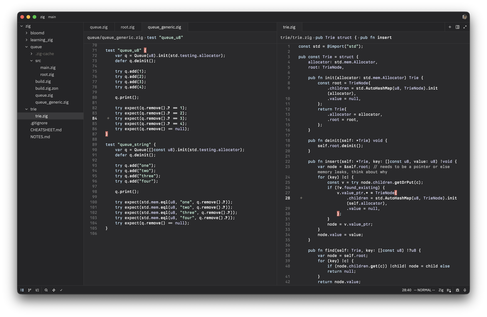
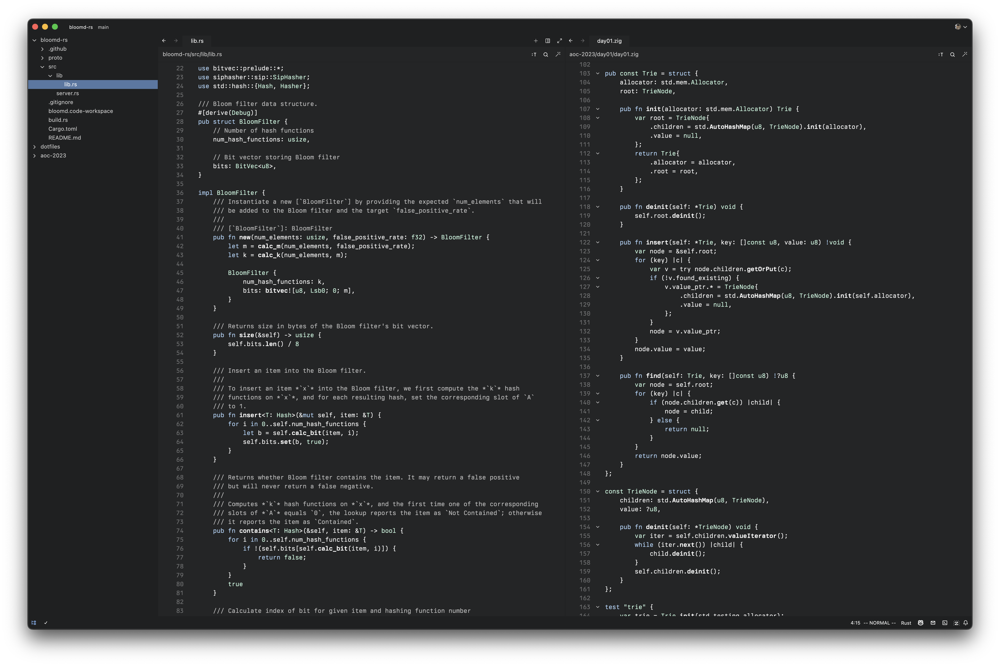
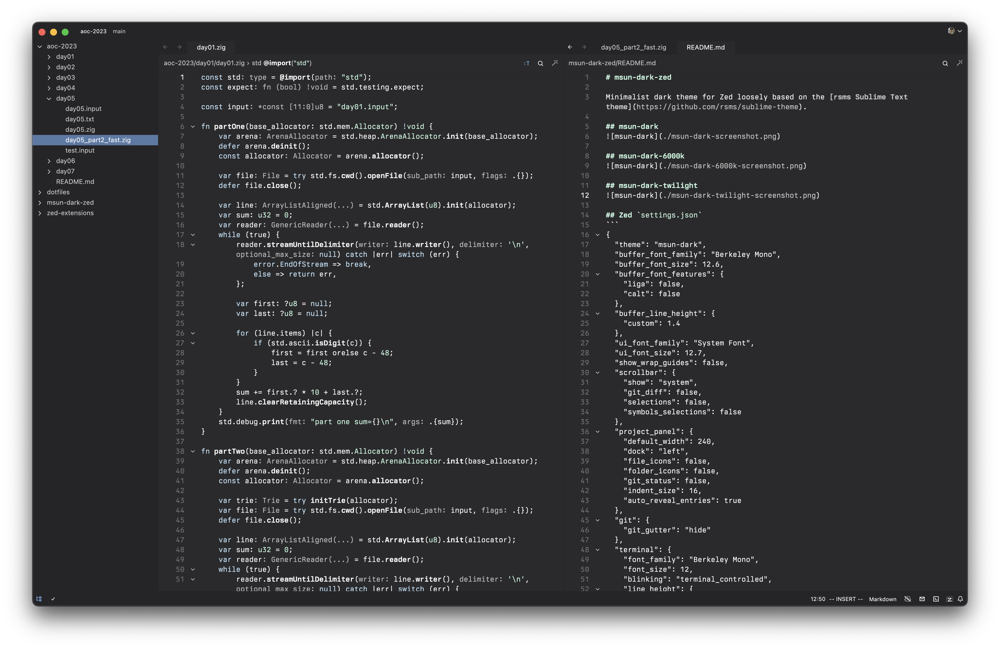

# msun-dark-zed

Minimalist dark themes for Zed inspired by the [rsms Sublime Text theme](https://github.com/rsms/sublime-theme).

## msun-dark


## msun-dark-netherite


## msun-dark-elytra


## msun-dark-aurora


## msun-dark-halycon


## msun-dark-6000k


## msun-dark-twilight


## Bold style
I use bold for some syntax:

Zed `settings.json`
```json
{
 	"experimental.theme_overrides": {
		"syntax": {
			"function": {
				"font_weight": 700
			},
			"operator": {
				"font_weight": 800
			},
			"type": {
				"font_weight": null
			}
		}
	}
}
```
