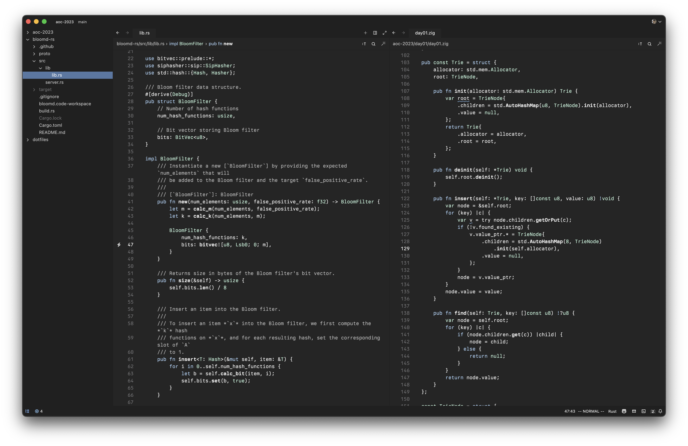

# msun-dark-zed

Minimalist dark theme for Zed loosely based on the [rsms Sublime Text theme](https://github.com/rsms/sublime-theme).



My Zed `settings.json`:

```
{
  "theme": "msun-dark",
  "buffer_font_family": "Berkeley Mono",
  "buffer_font_size": 12.6,
  "buffer_font_features": {
    "liga": false,
    "calt": false
  },
  "buffer_line_height": {
    "custom": 1.4
  },
  "ui_font_family": "System Font",
  "ui_font_size": 12.7,
  "show_wrap_guides": false,
  "scrollbar": {
    "show": "system",
    "git_diff": false,
    "selections": false,
    "symbols_selections": false
  },
  "project_panel": {
    "default_width": 240,
    "dock": "left",
    "file_icons": false,
    "folder_icons": false,
    "git_status": false,
    "indent_size": 16,
    "auto_reveal_entries": true
  },
  "git": {
    "git_gutter": "hide"
  },
  "terminal": {
    "font_family": "Berkeley Mono",
    "font_size": 12,
    "blinking": "terminal_controlled",
    "line_height": {
      "custom": 1.3
    }
  }
}
```
