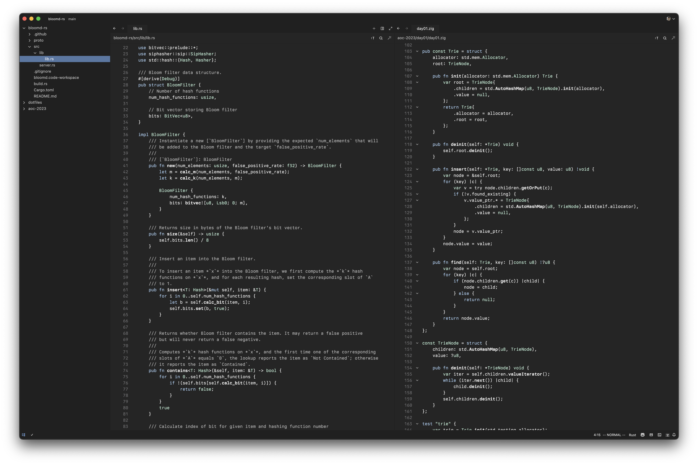
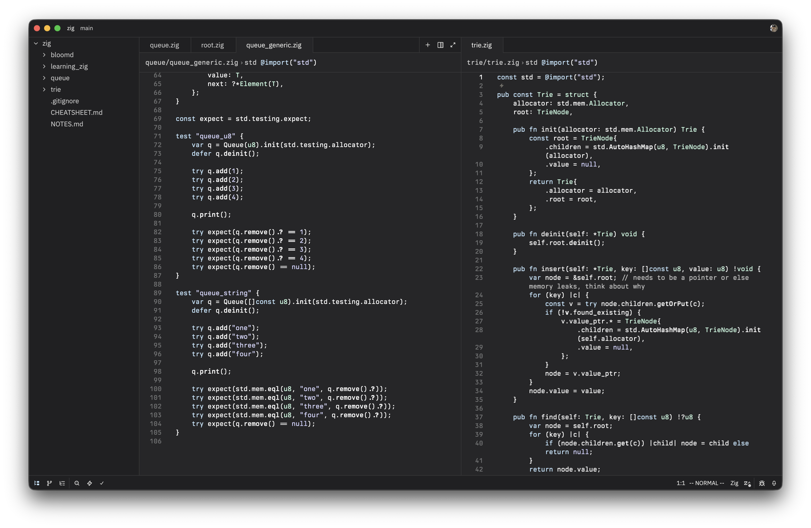
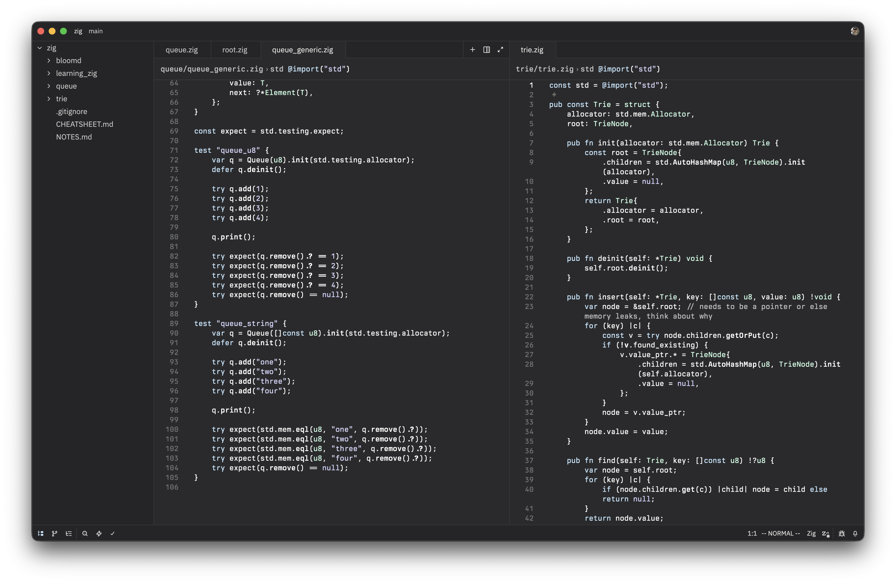
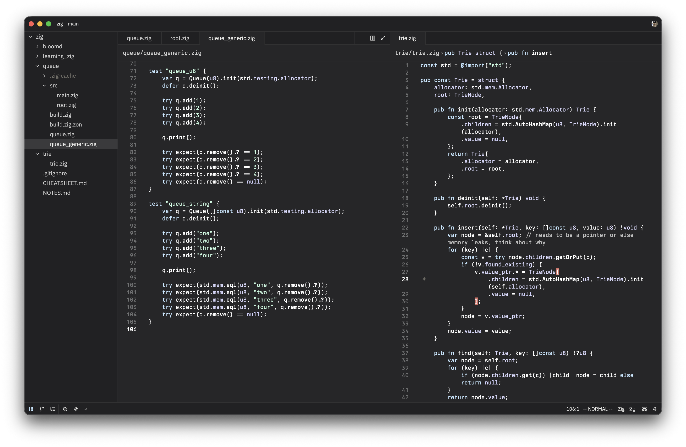
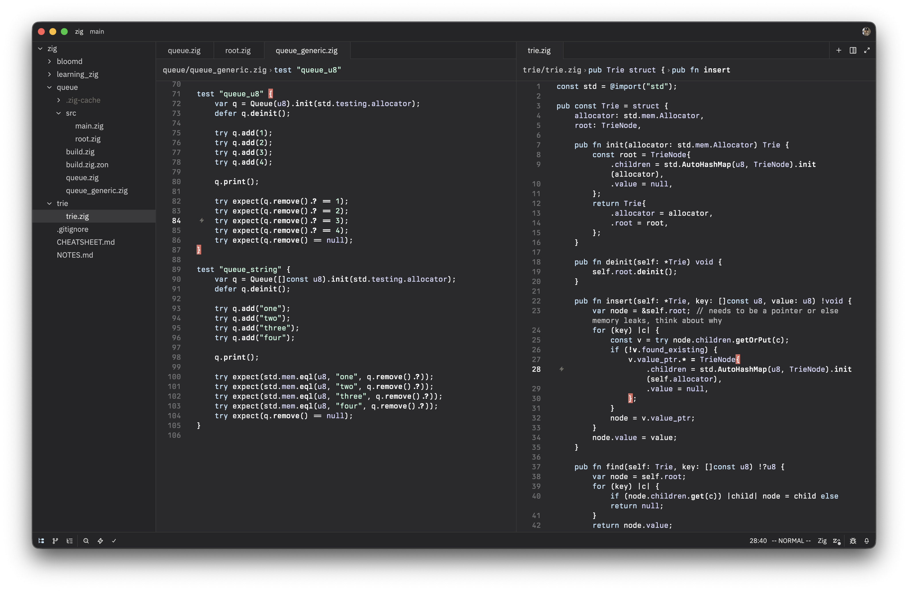
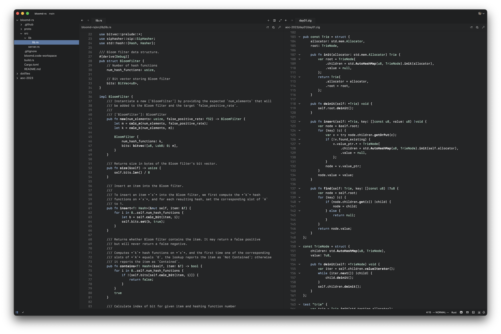
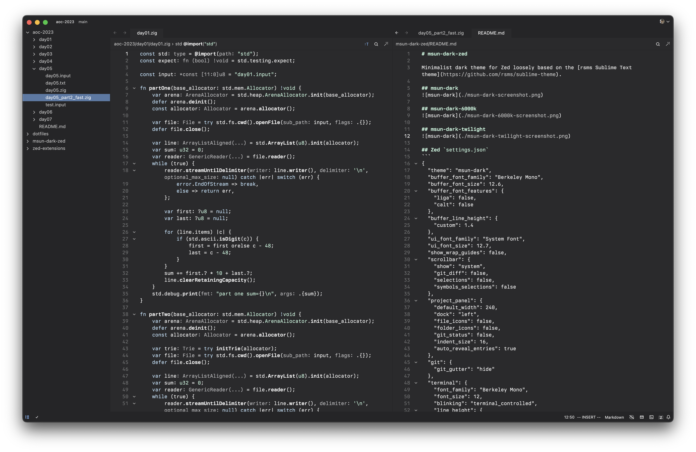

# msun-dark-zed

Minimalist dark themes for Zed. 

## msun-dark


## msun-dark-netherite


## msun-dark-elytra


## msun-dark-aurora


## msun-dark-halcyon


## msun-dark-6000k


## msun-dark-twilight


## Bold style
I use bold for some syntax:

Zed `settings.json`
```json
{
 	"experimental.theme_overrides": {
		"syntax": {
			"function": {
				"font_weight": 500
			},
			"operator": {
				"font_weight": 500
			},
			"type": {
				"font_weight": null
			}
		}
	}
}
```
